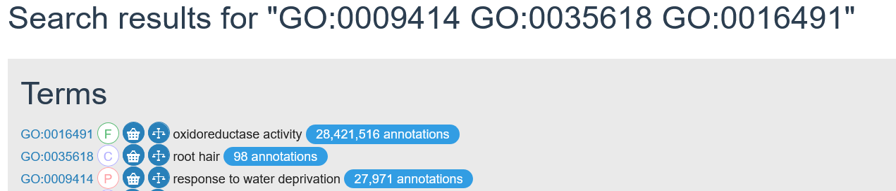
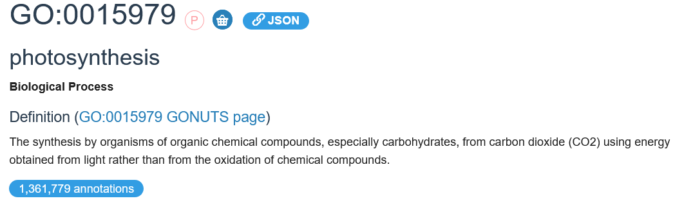
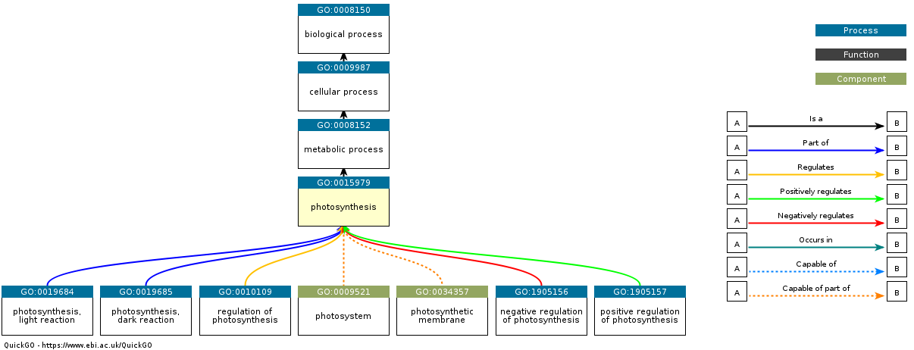
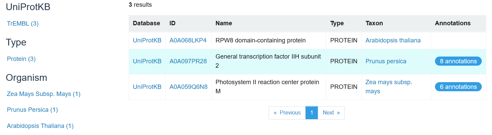
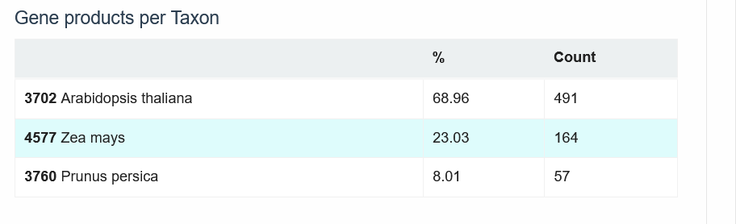

---
editor_options:
  markdown:
    wrap: 72
output: pdf_document
---

### Exercise 1

New DB name: /home/ahmed/bioinformatics/test_data/uniprot_Atha.fasta New
DB title: uniprot_Atha.fasta Sequence type: Protein Deleted existing
Protein BLAST database named
/home/ahmed/bioinformatics/test_data/uniprot_Atha.fasta Keep MBits: T
Maximum file size: 3000000000B Adding sequences from FASTA; added 15719
sequences in 0.222235 seconds.

Therefore we have 15719 formatted sequences. When the number of
sequences increases, the database size increases This increases BLAST
E‑values because the probability of obtaining that score by chance
increases as its a bigger database. This means hits appear less
statistically significant in larger databases than in smaller ones.
source: <https://sequenceserver.com/blog/blast-e-value-meaning/>
<https://www.metagenomics.wiki/tools/blast/evalue>

### Exercise 2

446 blastp -db uniprot_Atha.fasta -query test.faa -outfmt 6 \>
test.faa.blast 448 blastx -db uniprot_Atha.fasta -query test.fna -outfmt
6 \> test.fna.blast

### Exercise 3

According to the BLAST Help user manual, the default output format is
pairwise (-outfmt 0) source:
<https://blast.ncbi.nlm.nih.gov/doc/blast-topics/resultformatoptions.html>

Example from the blastx output: \>sp\|Q9ZTX8\|ARFF_ARATH Auxin response
factor 6 OS=Arabidopsis thaliana OX=3702 GN=ARF6 PE=1 SV=2 Length=935

Score = 1706 bits (4419), Expect = 0.0, Method: Compositional matrix
adjust. Identities = 935/935 (100%), Positives = 935/935 (100%), Gaps =
0/935 (0%) Frame = +1

Query 1 MRLSSAGFNPQPHEVTGEKRVLNSELWHACAGPLVSLPPVGSRVVYFPQGHSEQVAASTN 180
MRLSSAGFNPQPHEVTGEKRVLNSELWHACAGPLVSLPPVGSRVVYFPQGHSEQVAASTN Sbjct 1
MRLSSAGFNPQPHEVTGEKRVLNSELWHACAGPLVSLPPVGSRVVYFPQGHSEQVAASTN 60

Query 181 KEVDAHIPNYPSLHPQLICQLHNVTMHADVETDEVYAQMTLQPLNAQEQKDPYLPAELGV
360 KEVDAHIPNYPSLHPQLICQLHNVTMHADVETDEVYAQMTLQPLNAQEQKDPYLPAELGV Sbjct
61 KEVDAHIPNYPSLHPQLICQLHNVTMHADVETDEVYAQMTLQPLNAQEQKDPYLPAELGV 120

Query 361 PSRQPTNYFCKTLTASDTSTHGGFSVPRRAAEKVFPPLDYSQQPPAQELMARDLHDNEWK
540 PSRQPTNYFCKTLTASDTSTHGGFSVPRRAAEKVFPPLDYSQQPPAQELMARDLHDNEWK Sbjct
121 PSRQPTNYFCKTLTASDTSTHGGFSVPRRAAEKVFPPLDYSQQPPAQELMARDLHDNEWK 180

Query 541 FRHIFRGQPKRHLLTTGWSVFVSAKRLVAGDSVLFIWNDKNQLLLGIRRANRPQTVMPSS
720 FRHIFRGQPKRHLLTTGWSVFVSAKRLVAGDSVLFIWNDKNQLLLGIRRANRPQTVMPSS Sbjct
181 FRHIFRGQPKRHLLTTGWSVFVSAKRLVAGDSVLFIWNDKNQLLLGIRRANRPQTVMPSS 240

Query 721 VLSSDSMHLGLLaaaahaaaTNSRFTIFYNPRASPSEFVIPLAKYVKAVYHTRVSVGMRF
900 VLSSDSMHLGLLAAAAHAAATNSRFTIFYNPRASPSEFVIPLAKYVKAVYHTRVSVGMRF Sbjct
241 VLSSDSMHLGLLAAAAHAAATNSRFTIFYNPRASPSEFVIPLAKYVKAVYHTRVSVGMRF 300

### Exercise 4

The difference betweent the blastx and the blastp search results is that
one shows the protein sequence hits themselves and therefore is a direct
comparison, while the blastx searches using the transcript infromation
therefore translation is needed and it can be slower. Both blasts had
the Q9ZTX8 as their top hit with 100% valid identity. blastp had a
bitscore of 1915 and the blastx had a bitscore of 1706, slightly lower.
Both had strong E-scores Source:
<https://www.nlm.nih.gov/ncbi/workshops/2023-08_BLAST_evol/e_value.html>
<https://card.mcmaster.ca/ontology/40725>

### Exercise 5

the profile.out file is a position-specific scoring matrix (PSSM), which
shows scores for specific amino acid positions and their likely
substitutions in our query sequence (ARF6). They are generated from many
sequence alignments in this case 3. They are used to detect more protein
alignments beyond BLAST as instead of making the assumption that each
position in the sequence is as likely as the other to change, it scores
based on the positions themselves, better mirroring biological reality.
source:
<https://www.nlm.nih.gov/ncbi/workshops/2023-08_BLAST_evol/blast_score.html>

### Exercise 6

Ran

``` bash
awk '$12 > 200 {print $2}' test.faa.blast > high_score_ids.txt
while read id; do grep -A 1 "^>.*$id" uniprot_Atha.fasta; done < high_score_ids.txt > high_score_seqs.faa
clustalo -i high_score_seqs.faa -o high_score_alignment.aln --outfmt=clustal
hmmbuild ARF6.hmm high_score_alignment.aln
hmmpress ARF6.hmm
hmmscan --tblout ARF6_hmmscan.tbl ARF6.hmm uniprot_Atha.fasta > ARF6_hmmscan.out
```

We were searching for accessions from BLAST hits with high bit scores,
then taking the complete protein sequences of those matches from the
uniprot_Atha.fasta file. Clustal Omega performed a multiple sequence
alignment of these sequences, the results from the hmmscan showed hits
from homologous accessions in the Auxin Response Factor (ARF) gene
family of Arabidopsis Thaliana. This is confirmed by the low E-scores
and similar number of hits for both the BlastP hits and the HMM hits.
The proteins of this family are very similar as many have overlapping
functions. This HMM validate our blastp and blastx query results.

source: <https://www.uniprot.org/citations/15659631>

The table of the HMMscan hits:


### Exercise 7

Run

``` bash
grep -A 1 "ARF6" uniprot_Atha.fasta > AT1G30330.faa
```

get

> sp\|Q9ZTX8\|ARFF_ARATH Auxin response factor 6 OS=Arabidopsis thaliana
> OX=3702 GN=ARF6 PE=1 SV=2
> MRLSSAGFNPQPHEVTGEKRVLNSELWHACAGPLVSLPPVGSRVVYFPQGHSEQVAASTN

|   | Hit | Name | Query Boundaries | Template Boundaries | Aligned cols | Probability | E-value | Score |
|--------|--------|--------|--------|--------|--------|--------|--------|--------|
| 1 | 4LDU_A | Auxin response factor 5; transcription factor, DNA binding protein, nucleus; 2.15A (Arabidopsis thaliana) | 17-59 | 46-88 | 43 | 99.26% | 1.2e-11 | 75.22 |
| 2 | 4LDV_A | Auxin response factor 1; Transcription Factor, DNA binding, Nucleus, TRANSCRIPTION; HET: FMT; 1.45A (Arabidopsis thaliana) | 17-58 | 14-55 | 42 | 99.06% | 5.9e-10 | 66.66 |
| 3 | 8OJ2_A | Auxin response factor; Molecular caliper, Auxin Response Factor, Transcription factor, DNA binding, Nucleus, Hormone Response | 17-58 | 19-60 | 42 | 99.01% | 1.4e-9 | 65.13 |

| Align | DB:ID | Source | Length | Score(Bits) | Identities(%) | Positives(%) | E-value |
|---------|---------|---------|---------|---------|---------|---------|---------|
| 1 | AFDB:A0A397XXN9 | TF-B3 domain-containing protein UA=A0A397XXN9 UI=A0A397XXN9_BRACM OS=Brassica campestris OX=3711 GN=BRARA_I02823 | 294 | 126.3 | 98.3 | 100.0 | 4.9e-34 |
| 2 | AFDB:D7KET2 | Auxin response factor UA=D7KET2 UI=D7KET2_ARALL OS=Arabidopsis lyrata subsp. lyrata OX=81972 GN=ARALYDRAFT_473256 | 891 | 127.5 | 100.0 | 100.0 | 1.5e-32 |
| 3 | AFDB:A0A1J3J0G9 | Auxin response factor UA=A0A1J3J0G9 UI=A0A1J3J0G9_NOCCA OS=Noccaea caerulescens OX=107243 GN=MP_TR5073_c0_g1_i1_g.13971 | 898 | 127.5 | 100.0 | 100.0 | 1.5e-32 |
| 4 | AFDB:A0A1J3D2P2 | Auxin response factor UA=A0A1J3D2P2 UI=A0A1J3D2P2_NOCCA OS=Noccaea caerulescens OX=107243 GN=GA_TR2097_c0_g1_i1_g.6851 | 899 | 127.5 | 100.0 | 100.0 | 1.5e-32 |

### Exercise 8

Unfortunately the website <http://eggnog-mapper.embl.de/> was broken.
Will try again another day.

### Exercise 9

1)



2)

3)

4)

A0A068LKP4 has no GO annotation

A0A097PR28 has 8 GO annotations, GO terms for its molecular functions
(MF) involved in ion binding. Biological functions (BF) involved in to
DNA repair

A0A059Q6N8 has 6 annotations, BF pertaining to photosynthesis. Other
annotations locate it in different cellular components (cytoplasm;
chloroplast thylakoid membrane; photosystem II)

5)

[GO:0048366](https://www.ebi.ac.uk/QuickGO/term/GO:0048366) leaf
development [ 21,805 annotations
](https://www.ebi.ac.uk/QuickGO/annotations?goUsage=descendants&goUsageRelationships=is_a,part_of,occurs_in&goId=GO:0048366)
with 21,009 distinct gene products.

6)

491 proteins for *Arabidopsis Thaliana,* 164 for *Zea mays,* 57 for
*Prunus persica* are assigned to
[GO:0048366](https://www.ebi.ac.uk/QuickGO/term/GO:0048366)

7)

After selecting the right criteria in the search for *Arabidopsis
Thaliana* 3702 & *Prunus persica* 3760, the total number of Biological
Process annotations and proteins supported by the experimental evidence
codes
[(ECO:0000269)](https://github.com/evidenceontology/evidenceontology/blob/master/gaf-eco-mapping.txt)
was **423** annotations.
