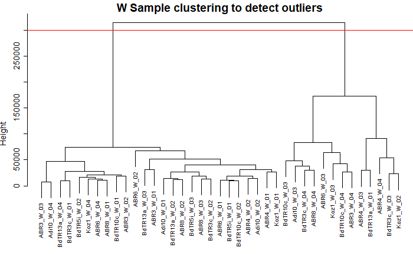
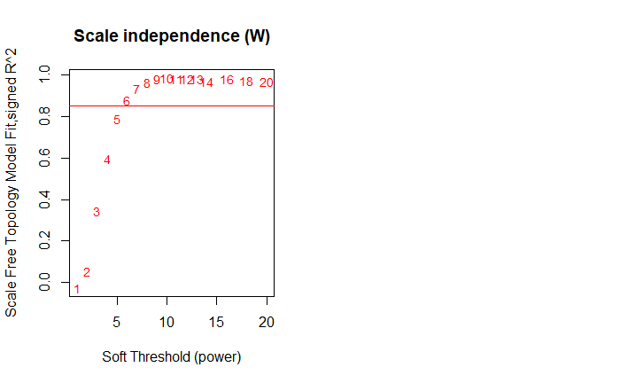

## Report for Session 3

**3.1) How many samples & isoforms are included in TPM_counts_Drought_W_dataset.csv?**

There were 39 samples and 9940 isoforms

**3.2) How many samples are discarded after outlier analysis?**

Using hierarchichal clustering to remove the outliers, 26 samples remained meaning 13 were outliers.



**3.3) What power value have you set as appropriate for calculating adjacency?**

Power value 6 was set as it was the first value to cross the 0.85 threshold line of the scale free topology fit index.



**3.4) How many co-expression modules are established before and how many after the module merging process?**

According to

```         
table(modulelabels_W)
```

There were 40 modules before the merging process.

According to

```         
table(modulecolors_W)
```

There are 36 modules after merging.

**3.5) What is the hub isoform (or hub gene) of the cyan module?**

According to

`chooseTopHubInEachModule( datExprW, modulecolors_W, omitColors = "grey", power = 6, type = "unsigned")`

Bradi1g00700.3 is the hub gene of the cyan module

**3.6) According to the module-trait association heat map, which module has the highest positive correlation with the "blwgrd (below ground biomass)" trait?**

Looking at the heatmap, the module with the highest positive correlation with below ground biomass was MEviolet with a correlation of 0.66.

The correlation was also statistically significant with a P value of 3e-04.
