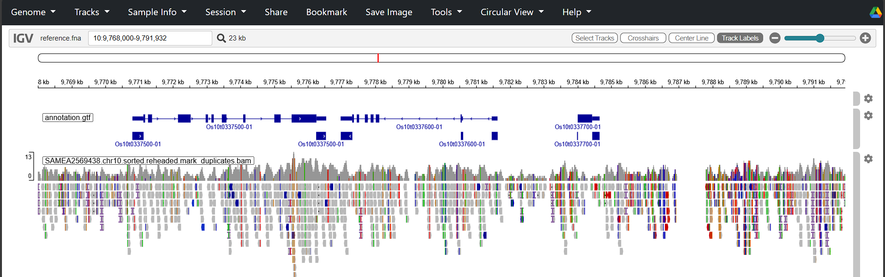
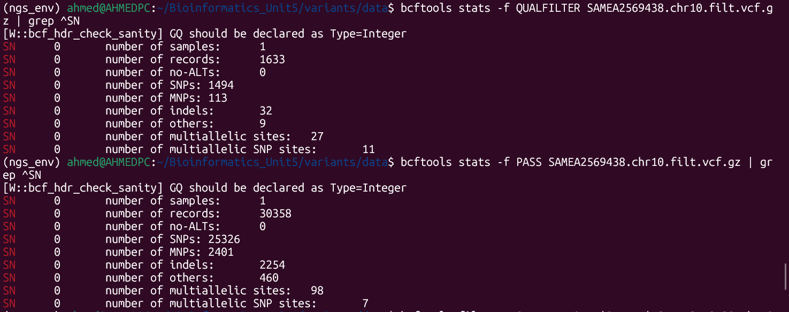
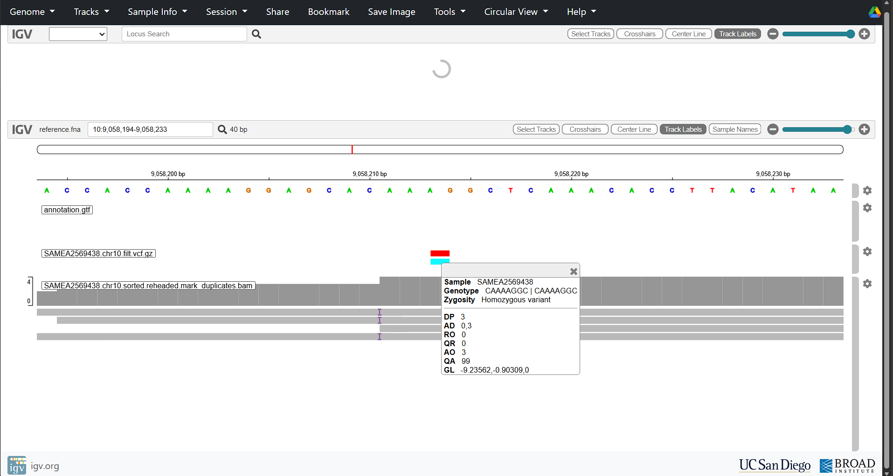
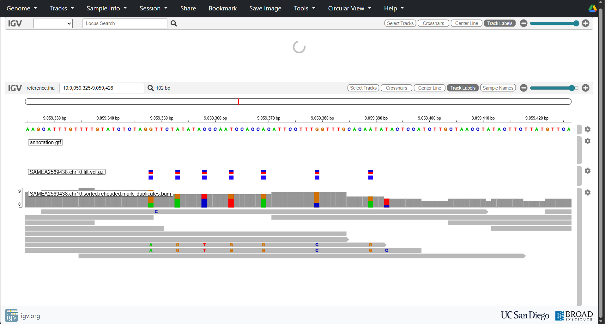
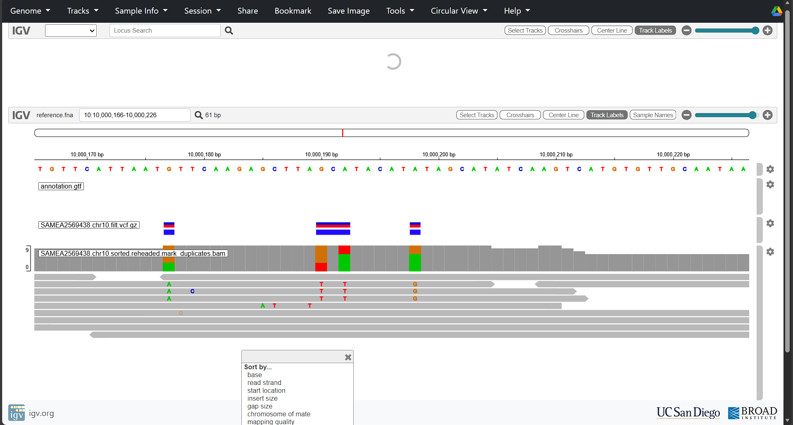

## Session 5 Variant Calling Report

### Exercise 1

1)  **Note that there are 2 FASTQ files with the same name but different numeric suffix, why?**

    There are two FASTQ files with different suffixes because they are the reverse and forward reads of the pair-end sequence experiment. \_1 is forward \_2 is reverse.

2)  **Check first SAMEA2569438.chr10_1.fastq.gz and then SAMEA2569438.chr10_2.fastq.gz, can you spot \* the difference? Do you recognize the typical FASTQ format of these files?**

    I cant really see a difference between the two FASTQC files the \_2 file, which is the reverse read has slightly lower quality scores at the end read position, but still well within good quality.

3)  **Are read starts and ends similar in terms of error rate?**

    Read starts and ends are not similar, both the forward and reverse read show lower error rates at the start with even lower error rates through the middle, and then slightly higher error rates at the ends. This is expected from illumina based sequencing instrument and is mainly due to phasing, there is more signal mixing over cycles and this leads to more cumulative errors. However the read quality is still within the high quality range.

    Source: <https://www.ecseq.com/support/ngs/why-has-reverse-read-a-worse-quality-than-forward-read-in-Illumina-sequencing>

### Exercise 2

After creating the 3 formats (BAM, SAM, CRAM) using:

``` bash
bwa mem reference.fna SAMEA2569438.chr10_1.fastq.gz SAMEA2569438.chr10_2.fastq.gz | samtools view -b -o SAMEA2569438.chr10.bam
 
bwa mem reference.fna SAMEA2569438.chr10_1.fastq.gz SAMEA2569438.chr10_2.fastq.gz | samtools view -o SAMEA2569438.chr10.sam
 
bwa mem reference.fna SAMEA2569438.chr10_1.fastq.gz SAMEA2569438.chr10_2.fastq.gz | samtools view -C -T reference.fna > SAMEA2569438.chr10.cram
```

I got 94 megabytes for SAM, 32 megabytes for BAM and 12 megabytes for CRAM. This makes sense as SAM (Sequence Alignment Map) is the uncompressed format of the text-based sequence data, while BAM (Binary Alignment Map) is the sequence data converted into lossless compressed binary format, CRAM is also compressed but is lossy (more compressed), hence it being the smallest size, it achieves this through using reference-based compression.

source: <https://gatk.broadinstitute.org/hc/en-us/articles/360035890791-SAM-or-BAM-or-CRAM-Mapped-sequence-data-formats>

### Exercise 3

Reading through the samtools mpileup documentation, at first I ran:

```         
$ samtools mpileup -f reference.fna SAMEA2569438.chr10.sorted.bam | more
```

Then in the see also section I found documentation specifically related to samtools depth (source: <https://www.htslib.org/doc/samtools-depth.html>), that has some benefits in terms of calculation, therefore to find the percentage of chr10 with \>100 depth I ran:

``` bash
samtools depth SAMEA2569438.chr10.sorted.bam | awk '$3 > 100' | wc -l

echo "scale=4; 53457 / 23207287 * 100" | bc
```

which gave me a percentage of 0.23%.

### Exercise 4

For allignment post-processing I ran:

``` bash
picard AddOrReplaceReadGroups I=SAMEA2569438.chr10.sorted.bam RGSM=SAMEA2569438 RGLB=SAMEA2569438 RGPL=ILLUMINA O=SAMEA2569438.chr10.sorted.reheaded.bam RGPU=SAMEA2569438

picard MarkDuplicates I=SAMEA2569438.chr10.sorted.reheaded.bam O=SAMEA2569438.chr10.sorted.reheaded.mark_duplicates.bam M=SAMEA2569438.chr10.metrics.txt
```

This added the metadata (\@RG) to the alignment file, and then marked the duplicates created during the PCR amplification.

I then loaded all the necessary local files from my WSL into the Interactive Genome Viewer (<https://igv.org/app>)

These were:

Genome -Local Files

reference.fna

reference.fna.fai

Tracks - Local Files

annotation.gtf

SAMEA2569438.chr10.sorted.reheaded.mark_duplicates.bam

SAMEA2569438.chr10.sorted.reheaded.mark_duplicates.bam.bai

Then I searched chromosome location 10:9,768,000-9,791,932

and was able to visualize the location as seen here:



### Exercise 5

Using the VCF file I filtered out the artifactual variants with

``` bash
$ bcftools filter -sQUALFILTER -e'QUAL<1' SAMEA2569438.chr10.vcf.gz -o SAMEA2569438.chr10.filt.vcf.gz -Oz

$ bcftools view -H SAMEA2569438.chr10.filt.vcf.gz | more

$ bcftools view -H -f QUALFILTER SAMEA2569438.chr10.filt.vcf.gz | more

$ bcftools stats -f QUALFILTER SAMEA2569438.chr10.filt.vcf.gz | grep ^SN

$ bcftools stats -f PASS SAMEA2569438.chr10.filt.vcf.gz | grep ^SN
```

from these scripts I got :

``` bash
(ngs_env) ahmed@AHMEDPC:~/Bioinformatics_Unit5/variants/data$ bcftools stats -f QUALFILTER SAMEA2569438.chr10.filt.vcf.gz | grep ^SN [W::bcf_hdr_check_sanity] GQ should be declared as Type=Integer SN 0 number of samples: 1 SN 0 number of records: 1633 SN 0 number of no-ALTs: 0 SN 0 number of SNPs: 1494 SN 0 number of MNPs: 113 SN 0 number of indels: 32 SN 0 number of others: 9 SN 0 number of multiallelic sites: 27 SN 0 number of multiallelic SNP sites: 11 (ngs_env) ahmed@AHMEDPC:~/Bioinformatics_Unit5/variants/data$ bcftools stats -f PASS SAMEA2569438.chr10.filt.vcf.gz | grep ^SN [W::bcf_hdr_check_sanity] GQ should be declared as Type=Integer SN 0 number of samples: 1 SN 0 number of records: 30358 SN 0 number of no-ALTs: 0 SN 0 number of SNPs: 25326 SN 0 number of MNPs: 2401 SN 0 number of indels: 2254 SN 0 number of others: 460 SN 0 number of multiallelic sites: 98 SN 0 number of multiallelic SNP sites: 7
```



Therefore through my filtering I removed 1633 variants compared to the sessions 1031, this could be due to a different software version of freebayes.

I then created an index (.csi) of the filtered vcf file with script:

```         
bcftools index SAMEA2569438.chr10.filt.vcf.gz
```

Then went to the IGV and in addition to the files added in exercise 4, I uploaded to the tracks:

SAMEA2569438.chr10.filt.vcf.gz

SAMEA2569438.chr10.filt.vcf.gz.csi

I then went to location 10:9,058,195-9,058,234

and found the indels



**Take a look to INDEL variant at 10:9,058,200-9,058,229. What are the reference and alternative alleles? It this position heterozygous in your mapped sample?**

The reference allele is CAAAGGC and the alternative allele is CAAAAGGC, therefore this is an insertion, this position is homozygous.

**Check the SNPs at 10:9,059,325-9,059,426. Are they all similar in terms of read dpeth (DP)?**



The SNPs range in depth from 8-5. This means that these SNPs are low-confidence as they dont have enough reads supporting each variant call. This is in line with the low depth coverage observed for this sample.

**Examining the aligned reads supporting the SNPs at 10:10,000,166-10,000,226 by loading the BAM and index files. Do any of these fall into a gene model? Save the resulting image.**



There is no annotation therefore it is most likely an intergenic region.

This report was created by the author with the help of Claude through confirmations of questions and tweaking of scripts, the full prompts can be found here:
https://claude.ai/chat/5d1f6254-06b6-4ade-9289-fcb686e4ae4c

